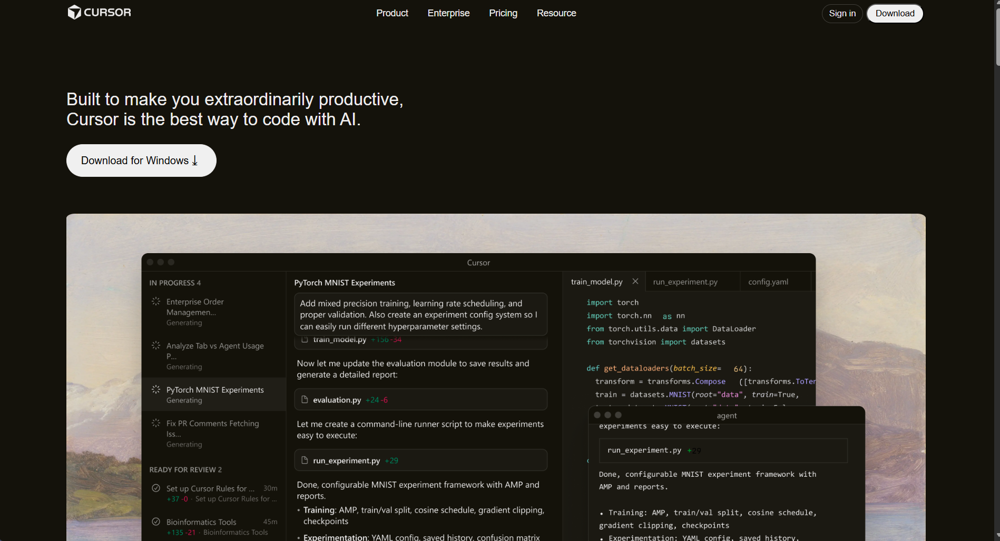
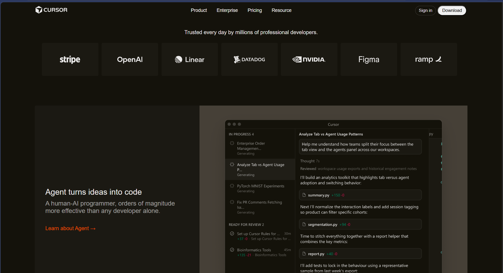
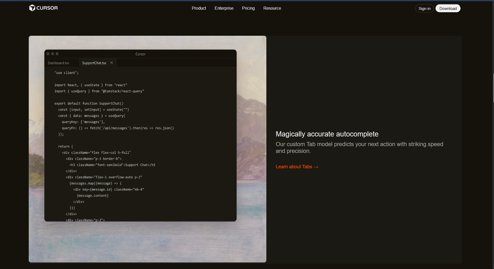
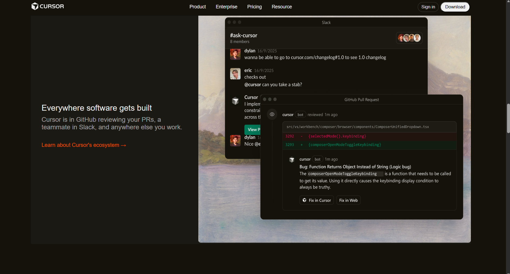
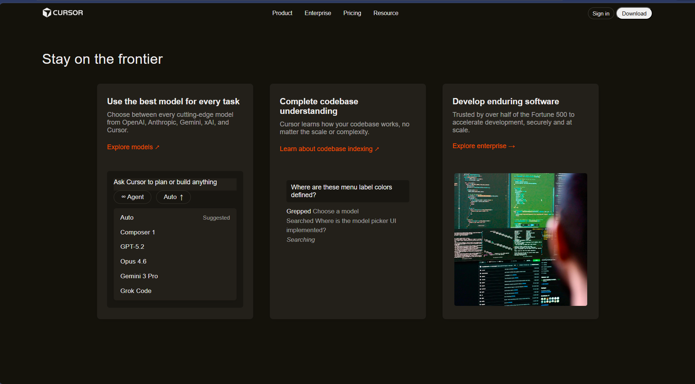
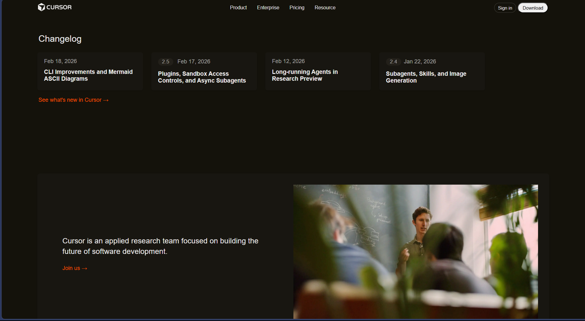
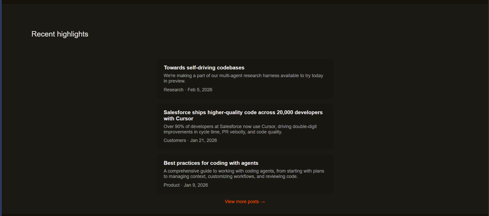
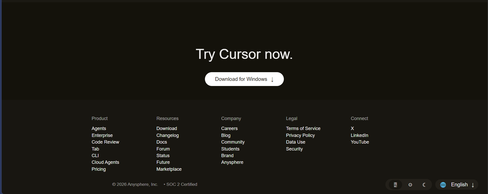

# Cursor Webpage Project

This project is a static, responsive landing page for Cursor, built with HTML and CSS. It features a modern UI, multiple sections, and a custom footer.

## Features
- Hero section with call-to-action
- Client logos
- About and testimonial sections
- Changelog and highlights
- Download CTA
- Multi-column footer with theme and language controls
- Responsive design

## Getting Started

### Prerequisites
- Any modern web browser (Chrome, Edge, Firefox, etc.)
- No backend or build tools required

### Running the Project
1. **Clone the repository**
   ```sh
   git clone https://github.com/piyushgaikwad0205/cursor-assigment.git
   ```
2. **Navigate to the project folder**
   ```sh
   cd cursor-assigment/Cursor
   ```
3. **Open `index.html` in your browser**
   - Double-click `index.html` or right-click and choose "Open with" your browser.

That's it! The webpage should display as designed.

## Project Structure
```
Cursor/
  index.html
  style.css
  assets/
    app-images/
    frontire/
    icon/
    patners/
    profile/
Images/
  image1.png
  image2.png
  image3.png
  image4.png
  image5.png
  image6.png
  image7.png
  image8.png
Readme.md
```

## Webpage Screenshots
Below are images showing the different sections of the webpage:

|  |
|:--:|
|  |
|  |
|  |
|  |
|  |
|  |
|  |

---

Feel free to explore and modify the project as needed!
